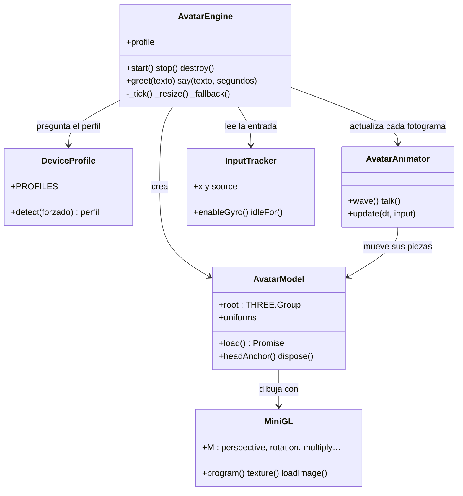

# Avatar 3D y motor del avatar · Documentación del ejercicio

**Alumna:** Serena Sania Esteve · DAM (TAME Formación)
**Resultado de aprendizaje:** aplica tecnologías de desarrollo para dispositivos móviles evaluando sus características y capacidades.

El proyecto es un avatar que se parece a mí: mi ilustración con el pelo granate en moño, el polo de rayas, los vaqueros y mi portátil lleno de pegatinas, convertida en un personaje **2.5D** que reacciona en WebGL. Está integrado en mi portafolio:
- **saluda al entrar**: cambia a la pose con la mano levantada, **mueve la mano**, te guiña un ojo, da un saltito y aparece un bocadillo;
- **gira la cabeza y los ojos hacia el cursor** (en móvil, hacia el dedo o según la inclinación del teléfono);
- **parpadea y respira**, y **los mechones sueltos se mueven** como con brisa;
- **saluda según la hora** ("¡Buenos días!", "¡Buenas tardes!"…) y vuelve a saludar con una frase cada vez que la tocas;
- **responde al tocarlo**.

Todo lo relacionado con el avatar está en la carpeta `avatar/`, separado del `index.html`.

### Cómo funciona el efecto 3D
1. `serena-color.webp`: la ilustración recortada, con fondo transparente.
2. `serena-depth.png`: un **mapa de profundidad** en escala de grises (blanco = cerca: portátil, cara, mano; negro = lejos). Lo genera **Depth Anything V2**, un modelo de IA que estima la profundidad a partir de una sola imagen. Después, el script lo limpia:
   - un cierre morfológico quita las líneas del dibujo, que la IA interpreta como surcos;
   - una dilatación hace que lo cercano "desborde" su contorno y el borde del portátil no se desgarre al girar;
   - un desenfoque gaussiano suaviza las transiciones.
3. Un **shader** (programa de la GPU) desplaza cada píxel según su profundidad y la posición del cursor. Lo cercano se mueve más que lo lejano, y eso se percibe como un giro en 3D. Además, el plano se inclina con una cámara en perspectiva.
4. En el mismo shader, los ojos se deslizan dentro de su contorno (definido como elipses en píxeles de la imagen) y el parpadeo cubre el ojo con el color del párpado, dejando la línea de pestañas.
5. **Saludo:** hay una segunda ilustración (`serena-saludo.webp`) con la mano levantada, preparada con `tools/preparar-ilustracion.py`. Durante el saludo, el shader:
   - pasa de una pose a la otra en 0,18 s;
   - interpola la posición de los ojos entre ambas poses;
   - **gira la mano sobre la muñeca** (±11°). Solo afecta a los píxeles por encima de la muñeca y dentro de una elipse alrededor de la mano. Como detrás de la mano solo hay fondo transparente, la rotación no deja huecos.

### Iteraciones (por qué esta técnica)
| Versión | Técnica | Resultado |
|---|---|---|
| 1 | Modelo 3D procedural (esferas, cilindros), sombreado "toon" con contorno, brazos con cinemática inversa | Saludaba con el brazo, pero parecía un muñeco; ~70.000 triángulos |
| 2 | El mismo modelo con materiales PBR, ojos esféricos y pelo generado desde el cráneo | Mejor, pero seguía lejos del estilo de la ilustración; ~55.000 triángulos |
| 3 | Ilustración 2.5D con mapa de profundidad (con Three.js) | Se parece a mí de verdad; 2 triángulos y 1 llamada de dibujo |
| 4 | La misma técnica con WebGL directo | Mismo resultado visual y el código pasa de ~660 KB a ~60 KB |
| 5 | + segunda ilustración saludando y mano animada en el shader | Saluda moviendo la mano de verdad |
| 6 | + profundidad con IA, pelo con brisa, 9 poses extra, personalidad y "Pregúntame" | Relieve realista y un avatar con el que se puede conversar |
| 7 | Se quitan las 9 poses extra: solo la normal y la de saludar | Las poses venían de miniaturas y no daban la calidad de las dos ilustraciones principales |
| **8 (final)** | **Se quita "Pregúntame" (IA)** | El avatar se centra en saludar y reaccionar; sin backend PHP ni modelo de IA, funciona en cualquier hosting estático |

---

## Estructura del proyecto

```
portafolio-avatar/
├── index.html                  ← portafolio (solo "monta" el avatar)
├── assets/foto-serena.jpg
└── avatar/                     ← TODO lo del avatar
    ├── avatar.css              estilos del escenario, bocadillo y modo sin WebGL
    ├── demo.html               banco de pruebas (botones + panel de rendimiento)
    ├── tools/preparar-ilustracion.py   recorte + profundidad (IA) de una ilustración
    ├── DOCUMENTACION.md        este documento
    ├── assets/serena-color.webp  ilustración recortada (también se usa si no hay WebGL)
    ├── assets/serena-depth.png   mapa de profundidad
    └── js/
        ├── mini-gl.js          MiniGL         → WebGL mínimo: shaders, texturas y matrices
        ├── device-profile.js   DeviceProfile  → detecta el dispositivo y elige perfil
        ├── avatar-model.js     AvatarModel    → carga texturas y crea el plano con el shader
        ├── avatar-animator.js  AvatarAnimator → mirada, ojos, parpadeo, respiración, saludo
        ├── avatar-input.js     InputTracker   → ratón, táctil y giroscopio
        ├── avatar-behaviors.js AvatarBehaviors→ cuándo saluda y qué frase dice
        └── avatar-engine.js    AvatarEngine   → el motor: ciclo de vida y bucle de render
```

Para usarlo en cualquier página basta con:

```html
<div id="avatar-stage"></div>
<script src="avatar/js/mini-gl.js"></script>
<!-- … los 5 scripts de avatar/js … -->
<script>SerenaAvatar.mount('#avatar-stage', { greeting: '¡Hola! Soy Serena 👋' });</script>
```

---

## a) Limitaciones de ejecutar aplicaciones en dispositivos móviles

| Limitación | Qué problema causa en un avatar 3D | Cómo lo resuelve el motor |
|---|---|---|
| **GPU menos potente** | Pocos FPS, calentamiento | Solo 2 triángulos: todo el trabajo está en un shader sencillo; en gama baja, menos paralaje y 30 FPS |
| **Pantallas de alta densidad** (DPR 2,5–3,5) | Renderizar a 3× cuadruplica los píxeles | `pixelRatioMax` limita la resolución interna (1,25–2) |
| **Batería** | Un bucle a 60 FPS la gasta aunque no se vea | Se **pausa** al salir de pantalla (`IntersectionObserver`) y al pasar a segundo plano (`visibilitychange`); 30 FPS en gama baja |
| **Memoria RAM** | El navegador puede cerrar la pestaña | Dos texturas (≈ 270 KB), sin mipmaps; `destroy()` libera la GPU |
| **Red / datos móviles** | Descargas pesadas | Sin librerías 3D: se quitó Three.js (600 KB) y se sustituyó por `mini-gl.js` (≈ 7 KB). Todo el avatar pesa ≈ 610 KB (60 KB de código + 550 KB de imágenes WebP/PNG). La pose de saludo se descarga en segundo plano y no bloquea la primera imagen. Carga asíncrona; con `Save-Data` o 2G → perfil bajo |
| **Pérdida de contexto WebGL** | La GPU "se reinicia" y el lienzo queda negro | Se detecta `webglcontextlost` y se muestra la ilustración |
| **Sin WebGL** (navegadores antiguos) | No se puede dibujar 3D | Perfil `estatico`: se muestra la ilustración 2D |
| **No hay hover** en pantallas táctiles | "Seguir el cursor" no tiene sentido | Sigue el **dedo** y, tras tocarlo, la **inclinación del móvil** (giroscopio) |
| **Permisos** (iOS 13+) | El giroscopio exige permiso tras un gesto | `InputTracker.enableGyro()` lo pide al tocar el avatar |
| **Pantalla pequeña** | El personaje no cabe | La cámara calcula la distancia para que quepa a lo ancho y a lo alto (`_resize`) |
| **Accesibilidad** | Animaciones que marean | Respeta `prefers-reduced-motion` (sin balanceo, respiración ni brisa) |
| **Efecto cristal** (`backdrop-filter`) en la web | Desenfocar lo que hay detrás es de lo más caro para la GPU de un móvil | El perfil del motor se escribe en `<html data-perfil="…">`: en gama baja el cristal pasa a ser opaco y la aurora del fondo deja de moverse. La refracción "agua" (filtro SVG) solo se activa en Chromium con perfil alto. También se respeta `prefers-reduced-transparency` |

## b) Tecnologías de desarrollo para móviles

| Enfoque | Tecnologías | Ventajas | Inconvenientes |
|---|---|---|---|
| Nativo | Kotlin/Java (Android), Swift (iOS) | Máximo rendimiento y acceso al hardware | Dos bases de código |
| Multiplataforma | Flutter, React Native, .NET MAUI, Kotlin Multiplatform | Un código, apps nativas | Capa extra; 3D limitado |
| Web / PWA | HTML, CSS, JavaScript, WebGL | Funciona en cualquier navegador sin instalar | Menor acceso al hardware |
| Híbrida | Capacitor, Cordova | Empaqueta una web como app (APK/IPA) | Rendimiento depende del WebView |
| Motores 3D | Unity, Godot, **Three.js**, Babylon.js | Herramientas de escena y animación | Unity/Godot generan builds pesadas para una web |

**Elección:** WebGL directo con un shader propio en GLSL. Las primeras versiones usaban Three.js. Cuando el avatar pasó a ser un solo plano, la librería de 600 KB ya no aportaba nada, así que la sustituí por `mini-gl.js` (compilar shaders, subir texturas y 7 funciones de matrices). El avatar tiene que vivir dentro de mi portafolio web y funcionar en cualquier móvil sin instalar nada. Además, la misma carpeta se puede empaquetar como app Android con Capacitor (ver apartado c).

## c) Entorno de trabajo

1. **Editor:** Visual Studio Code.
2. **Servidor local** (los navegadores móviles necesitan HTTP, no `file://`):
   ```bash
   cd portafolio-avatar
   python3 -m http.server 8000
   # escritorio: http://localhost:8000     móvil en la misma wifi: http://IP-DEL-PC:8000
   ```
3. **Depuración:** Chrome DevTools → *Toggle device toolbar* (Ctrl+Shift+M).
4. **Depuración en un móvil real:** Android → Opciones de desarrollador → Depuración USB → en el PC `chrome://inspect`.
5. **Empaquetar como app Android (opcional)** con Capacitor:
   ```bash
   npm init -y
   npm install @capacitor/core @capacitor/cli @capacitor/android
   npx cap init "Serena Avatar" es.serenaesteve.avatar --web-dir .
   npx cap add android
   npx cap open android      # abre Android Studio → Run en el emulador
   ```

## d) Configuraciones que clasifican los dispositivos

`DeviceProfile.readCapabilities()` lee estas características del dispositivo:

| Característica | API del navegador | Para qué se usa |
|---|---|---|
| Tipo de puntero | `matchMedia('(pointer: coarse)')` | Táctil vs. ratón |
| Ancho de pantalla | `screen.width` / `innerWidth` | Móvil (< 600) · tablet (< 1100) · escritorio |
| Densidad de píxeles | `devicePixelRatio` | Limitar la resolución de render |
| Núcleos de CPU | `navigator.hardwareConcurrency` | Detectar gama baja |
| Memoria | `navigator.deviceMemory` (Chromium) | ≤ 2 GB → gama baja |
| Red | `navigator.connection.saveData` / `effectiveType` | Ahorro de datos → gama baja |
| Soporte 3D | `canvas.getContext('webgl2' / 'webgl')` | Si no hay → modo estático |
| Sensores | `DeviceOrientationEvent` | Activar el giroscopio |
| Preferencias | `prefers-reduced-motion` | Reducir animaciones |

## e) Perfiles: relación entre dispositivo y aplicación

| Perfil | Cuándo se elige | pixelRatio máx. | Paralaje | Ojos y parpadeo | FPS máx. |
|---|---|---|---|---|---|
| `alto` | Escritorio con WebGL | 2 | 0,03 | Sí | 60 |
| `medio` | Tablet o móvil moderno | 1,75 | 0,03 | Sí | 60 |
| `bajo` | ≤ 2 GB RAM, móvil con ≤ 4 núcleos, ahorro de datos o 2G | 1,25 | 0,022 | Sí | 30 |
| `estatico` | Sin WebGL | — | — | — | Imagen fija |

Se puede forzar un perfil desde la URL para probarlo: `index.html?perfil=bajo`, y ver el rendimiento con `?debug=1`.

## f) Estructura de la aplicación y clases utilizadas



**API de WebGL que se usa (vía `MiniGL`):** `getContext('webgl')`, `createShader` / `createProgram`, `createBuffer` + `vertexAttribPointer`, `createTexture` + `texImage2D`, `uniform*`, `blendFunc` (alfa premultiplicado) y `drawArrays(TRIANGLE_STRIP)`. Las matrices (perspectiva, traslación, rotaciones y escala) se calculan en JavaScript, en `MiniGL.M`.

**Comparación con una app Android nativa:**

| Android | En este proyecto |
|---|---|
| `Activity` (pantalla y ciclo de vida) | `AvatarEngine` (`start`, `stop`, `destroy`) |
| `onPause()` / `onResume()` | `visibilitychange` + `IntersectionObserver` |
| `View` / `SurfaceView` (dibujo) | `<canvas>` de `WebGLRenderer` |
| `SensorManager` (giroscopio) | `InputTracker` + `DeviceOrientationEvent` |
| Carpeta `res/` con recursos por densidad | Perfiles de `DeviceProfile` |
| `AndroidManifest.xml` (permisos) | `DeviceOrientationEvent.requestPermission()` |

**Técnicas destacables:**
- **Paralaje por profundidad (*depth parallax*):** el fragment shader hace 3 iteraciones para seguir el relieve del mapa de profundidad.
- **Máscaras elípticas de los ojos:** los ojos se definen como elipses rotadas en coordenadas de la imagen. Dentro de ellas se desplaza la muestra de textura (mirada) o se pinta el párpado (parpadeo y guiño).
- **Suavizado temporal:** la mirada y los ojos siguen el objetivo con amortiguación exponencial (`damp`), así no dan saltos aunque la entrada sea brusca.
- **Pose de saludo:** `waveImage` y `waveDepth` (por defecto, `assets/serena-saludo.webp` y su mapa de profundidad). El motor espera a que esté cargada (máx. 2 s) antes del primer saludo. Con `waveImage: null` se desactiva. El script `tools/preparar-ilustracion.py` genera ambos archivos a partir de cualquier dibujo con fondo blanco (con la misma técnica que usé para la ilustración principal).

## g) Modificaciones sobre una aplicación existente

La aplicación existente era mi portafolio (`index.html`). Cambios realizados:

1. **Hero:** la foto se sustituye por el avatar, con un estilo claro, rosa y serif. El propio avatar también se modificó en tres iteraciones (ver "Iteraciones" al principio).
2. **Se conserva todo el contenido:** los 72 proyectos, 12 tecnologías, experiencia, formación y contacto se extrajeron del archivo original con un script, para no perder ni cambiar nada.
3. **Errores corregidos del original:**
   - La función `showPage()` estaba duplicada.
   - El botón SerenaGPT y sus estilos estaban duplicados.
   - Al final del archivo había un `<script>` roto, con HTML repetido dentro.
   - El email tenía 7 niveles anidados de `<span class="__cf_email__">` (de guardar varias veces la página procesada por Cloudflare) y enlaces `href="#"` que no hacían nada. Ahora son enlaces `mailto:` normales.
   - Había referencias a `#cursor` y `#cursor-ring`, que no existían.
   - La regla CSS `.proj-row:hover .pagination` estaba mal y `cursor:cursor` no era válido.
   - Las dos fotos estaban incrustadas en base64 y repetidas (~175 KB dentro del HTML). Ahora es un solo archivo, `assets/foto-serena.jpg`.
4. **Mejoras móviles:** menú hamburguesa, diseño adaptado y avatar controlado con el dedo o el giroscopio.
5. **Rediseño "Liquid Glass"** (inspirado en Apple):
   - fondo de aurora animada;
   - menú en forma de píldora flotante, con una lente de cristal que se desliza hasta la sección activa;
   - botones, tarjetas y chips de cristal con un reflejo que sigue al cursor;
   - efecto gelatina al pulsar;
   - refracción con `feDisplacementMap` en Chromium.

## h) Pruebas con emuladores

**Cómo probar:**
- **Chrome DevTools, modo dispositivo:** elegir iPhone SE, Pixel 7 o iPad. En *Performance* se puede usar *CPU 4× slowdown* para simular gama baja.
- **Sensores:** DevTools → ⋮ → *More tools* → *Sensors* → *Orientation*. Al cambiar los valores alpha, beta y gamma, el avatar gira la cabeza.
- **Android Studio (AVD):** crear un emulador (por ejemplo, Pixel 7, API 34) y abrir `http://10.0.2.2:8000/avatar/demo.html`, que es el `localhost` del PC visto desde el emulador. En *Extended controls* → *Virtual sensors* se puede mover el teléfono.
- **Página de pruebas:** `avatar/demo.html` tiene botones para saludar y hablar, un selector de perfil y el panel de FPS y triángulos.

**Plantilla de resultados** (rellenar con las mediciones):

| Dispositivo / emulador | Perfil detectado | FPS | Draw calls | Saludo al entrar | Sigue cursor / dedo | Giroscopio | Pausa fuera de pantalla |
|---|---|---|---|---|---|---|---|
| Escritorio (Chrome) | | | | | | — | |
| DevTools · iPhone SE | | | | | | | |
| DevTools · Pixel 7 + CPU 4× | | | | | | | |
| AVD Android Studio | | | | | | | |
| Móvil real | | | | | | | |
| `?perfil=estatico` | estatico | — | — | muestra la ilustración | — | — | — |


---

## Anexo · Revisión de errores (pruebas automáticas con Playwright)

Hice pruebas automáticas en Chromium, a 5 anchos de pantalla (1440, 1024, 768, 390 y 320 px): clics y perfiles de dispositivo. Encontraron y corregí estos fallos:

| Fallo | Causa | Solución |
|---|---|---|
| Saludaba aunque el avatar no estuviera en pantalla | El saludo no comprobaba la visibilidad | Queda pendiente y saluda al aparecer |
| En móvil, la página podía desplazarse de lado | `body { overflow-x: hidden }` es un contenedor desplazable | `overflow-x: clip`, que recorta sin desplazar |
| SerenaGPT tapaba "Tócame" en móvil | Botón fijo encima | Se oculta mientras se ve el hero |
| Botones pequeños para el dedo (24-29 px) | — | 44 px mínimo en pantallas táctiles (`pointer: coarse`) |

---

## Anexo · El portafolio como app instalable (PWA)

Además del avatar, el portafolio se convirtió en una **Progressive Web App**: en el móvil se puede "Añadir a pantalla de inicio", abre a pantalla completa como una app nativa y **funciona sin conexión**.

| Pieza | Archivo | Para qué sirve |
|---|---|---|
| Manifiesto | `manifest.webmanifest` | Nombre, iconos (192, 512 y *maskable* para Android), colores, `display: standalone` y accesos directos (Proyectos, Contacto, English) |
| Service worker | `sw.js` | Guarda la app en el móvil. Páginas: **primero la red** (siempre lo último) y, sin conexión, la copia guardada. CSS/JS/imágenes: **primero la caché** |
| Botón "Instalar app" | `index.html` (pie) | Solo aparece cuando el navegador lanza `beforeinstallprompt` |
| Publicación | `scripts/build.py` + `scripts/publicar.sh` | Pone versión a cada archivo (`?v=huella`), genera la versión inglesa (`/en/`), rellena la versión del service worker y crea `sitemap.xml` y `robots.txt` |

**Relación con los criterios:**
- **b) Tecnologías móviles:** la PWA es la cuarta vía, junto a la app nativa, la multiplataforma y la híbrida. Se instala desde el navegador, sin tienda de aplicaciones, y la misma base de código sirve para escritorio y móvil.
- **c) Entorno:** DevTools → *Application* → *Manifest* y *Service workers*. Para probar sin conexión: pestaña *Network* → *Offline*.
- **e) Perfil dispositivo-aplicación:** el manifiesto declara cómo se integra la app en cada sistema (icono adaptable en Android, `apple-touch-icon` en iOS, orientación y colores de la barra).
- **h) Pruebas:** Lighthouse (pestaña *Lighthouse* → categoría *PWA*). Prueba automática hecha: con la red cortada, `/` y `/en/` cargan con el avatar funcionando.

**Una trampa encontrada:** la caché del navegador puede mostrar una versión vieja de un CSS junto a un HTML nuevo (pasó: salía el avatar duplicado). Se resolvió con versiones por huella de contenido en cada archivo, `no-cache` para el HTML y el service worker, y las reglas críticas dentro del propio HTML.
